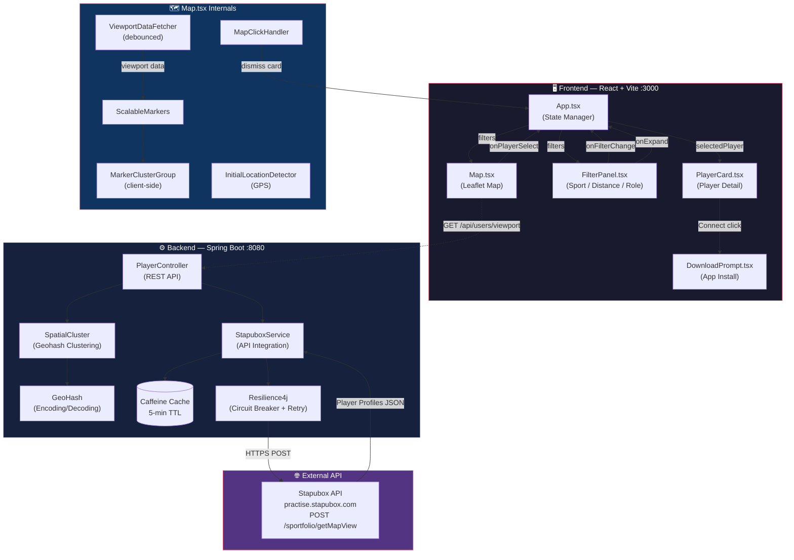
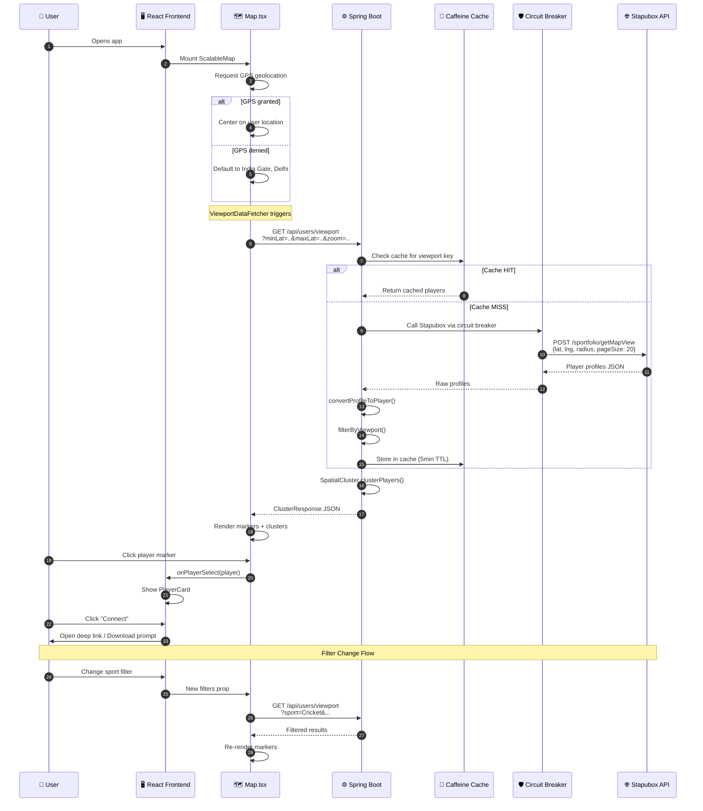
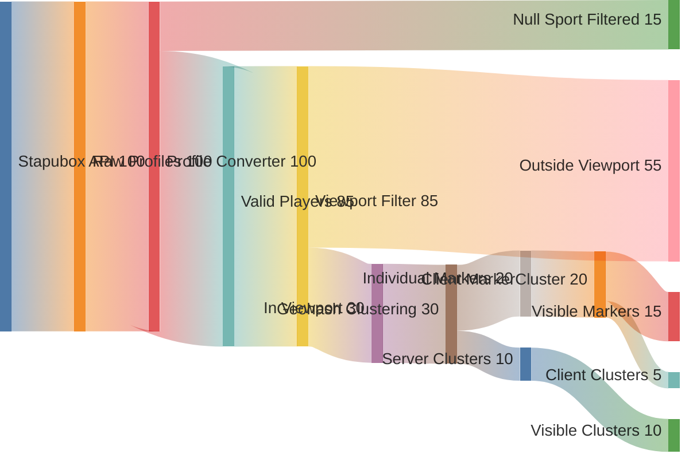
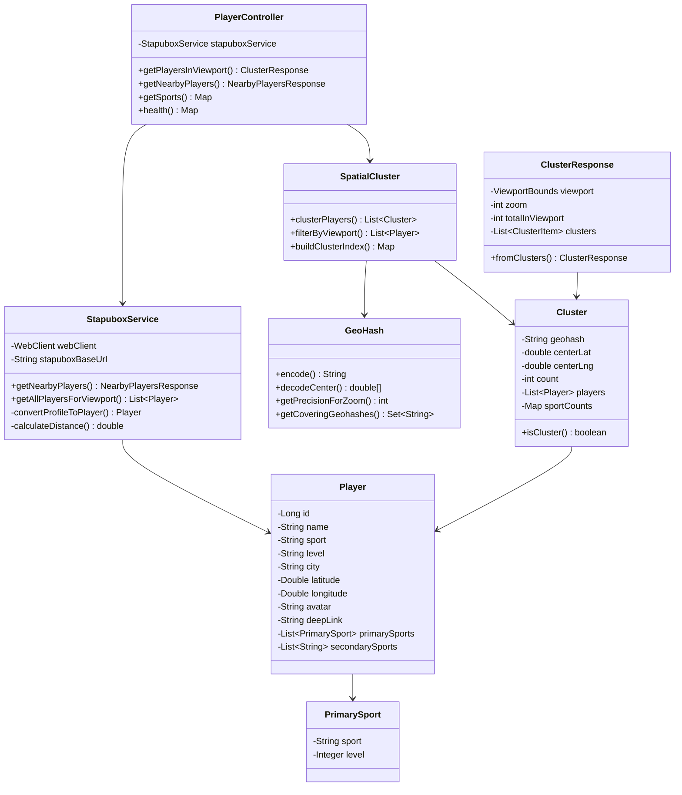
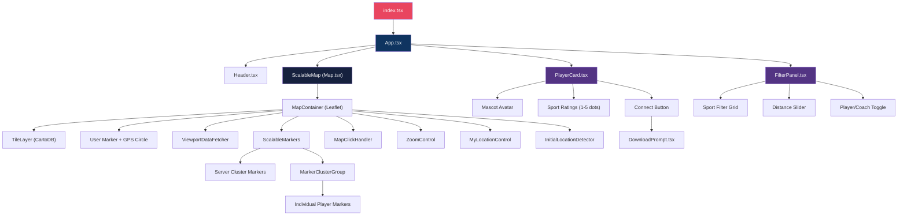

# SportsBuddy 🏏⚽🏸

**A real-time map-based sports player discovery platform** powered by StapuSearch. Find nearby sports players and coaches on an interactive map, filter by sport/distance/role, and connect with them via deep links.

---

## Architecture Overview

```
┌─────────────────────────────────────────────────────────────────────┐
│                        FRONTEND (Vite + React)                      │
│                         http://localhost:3000                        │
│                                                                     │
│  ┌──────────┐  ┌──────────────┐  ┌───────────┐  ┌───────────────┐  │
│  │  App.tsx  │  │  FilterPanel │  │ PlayerCard│  │    Map.tsx    │  │
│  │ (State)   │──│  (Filters)   │  │ (Detail)  │  │  (Leaflet)   │  │
│  │          │  │              │  │           │  │              │  │
│  │ filters  │  │ sport        │  │ mascot    │  │ ScalableMap  │  │
│  │ selected │  │ distance     │  │ sports    │  │ ViewportFetch│  │
│  │ Player   │  │ userType     │  │ connect   │  │ Markers      │  │
│  └────┬─────┘  └──────────────┘  └───────────┘  │ Clusters     │  │
│       │                                          │ GPS Circle   │  │
│       │  API calls on viewport change            └───────┬──────┘  │
│       └──────────────────────────────────────────────────┘          │
└──────────────────────────────────┬──────────────────────────────────┘
                                   │ HTTP REST
                                   ▼
┌─────────────────────────────────────────────────────────────────────┐
│                   BACKEND (Spring Boot + Java 17)                    │
│                        http://localhost:8080                         │
│                                                                     │
│  ┌──────────────────┐  ┌─────────────────┐  ┌───────────────────┐  │
│  │ PlayerController │  │ StapuboxService │  │    Utilities      │  │
│  │                  │  │                 │  │                   │  │
│  │ /users/viewport  │──│ API Integration │  │ SpatialCluster    │  │
│  │ /users/nearby    │  │ Profile Convert │  │ GeoHash encoding  │  │
│  │ /sports          │  │ Distance Calc   │  │ Grid clustering   │  │
│  │ /health          │  │ Caching (5min)  │  │ Viewport filter   │  │
│  └──────────────────┘  └────────┬────────┘  └───────────────────┘  │
│                                  │                                   │
│  ┌──────────────────────────────┐│  ┌─────────────────────────────┐ │
│  │        Config Layer          ││  │      Resilience Layer       │ │
│  │ CorsConfig, WebClientConfig  ││  │ Circuit Breaker, Retry      │ │
│  │ CacheConfig, RateLimiting    ││  │ Rate Limiter, Fallback      │ │
│  └──────────────────────────────┘│  └─────────────────────────────┘ │
└──────────────────────────────────┬──────────────────────────────────┘
                                   │ HTTPS POST
                                   ▼
┌─────────────────────────────────────────────────────────────────────┐
│                    STAPUBOX API (External)                           │
│              https://practise.stapubox.com                           │
│                                                                     │
│         POST /sportfolio/getMapView                                 │
│         → Returns player profiles with lat/lng, sports, avatar      │
│         → Radius-based search (max pageSize ~20)                    │
└─────────────────────────────────────────────────────────────────────┘
```

### System Architecture (Mermaid)



### API Request Sequence Diagram



### Data Flow Sankey Diagram



### Backend Class Diagram



### Frontend Component Tree



---

## Repository Structure

```
SportsBuddy/
│
├── MAPs-main/                    # 🖥️  FRONTEND (React + Vite + TypeScript)
│   ├── App.tsx                   # Root component - state management, API calls
│   ├── index.tsx                 # React entry point
│   ├── index.html                # HTML template
│   ├── types.ts                  # TypeScript interfaces (Player, FilterState, etc.)
│   ├── constants.ts              # Sport configs, colors, user location defaults
│   ├── vite.config.ts            # Vite config (port 3000)
│   ├── package.json              # Dependencies
│   │
│   ├── components/
│   │   ├── Map.tsx               # 🗺️  Core map (Leaflet) - markers, clusters, GPS, viewport fetching
│   │   ├── PlayerCard.tsx        # 👤 Player detail card (mascot, sports, connect button)
│   │   ├── FilterPanel.tsx       # 🔍 Filter UI (sport, distance, player/coach toggle)
│   │   ├── Header.tsx            # App header
│   │   ├── DownloadPrompt.tsx    # App download prompt modal
│   │   ├── CoachCard.tsx         # Coach detail card (currently unused)
│   │   └── HeatmapLayer.tsx      # Heatmap visualization (currently unused)
│   │
│   └── utils/
│       ├── useNearbyPlayers.ts   # Hook for legacy nearby players API
│       └── analytics.ts          # Analytics utilities
│
├── java-backend/                 # ⚙️  BACKEND (Spring Boot + Java 17)
│   ├── pom.xml                   # Maven dependencies
│   ├── mvnw                      # Maven wrapper
│   │
│   └── src/main/java/com/sportsbuddy/
│       ├── SportsBuddyApplication.java     # Spring Boot main class
│       │
│       ├── controller/
│       │   └── PlayerController.java       # REST API endpoints
│       │
│       ├── service/
│       │   └── StapuboxService.java        # Stapubox API integration + data transform
│       │
│       ├── model/
│       │   ├── Player.java                 # Player data model (Lombok)
│       │   ├── ClusterResponse.java        # Viewport API response model
│       │   ├── NearbyPlayersResponse.java  # Nearby API response model
│       │   ├── StapuboxMapViewRequest.java # External API request model
│       │   └── StapuboxMapViewResponse.java# External API response model
│       │
│       ├── config/
│       │   ├── CorsConfig.java             # CORS configuration
│       │   ├── WebClientConfig.java        # WebClient (HTTP client) config
│       │   ├── CacheConfig.java            # Caffeine cache (5-min TTL)
│       │   └── RateLimitingFilter.java     # Request rate limiting
│       │
│       ├── exception/
│       │   ├── GlobalExceptionHandler.java # Centralized error handling
│       │   └── ApiException.java           # Custom exceptions
│       │
│       └── util/
│           ├── SpatialCluster.java         # Geohash-based spatial clustering (O(n))
│           └── GeoHash.java               # Geohash encoding/decoding utilities
│
├── README.md                     # ← You are here
├── API_CALL_FLOW.md              # Detailed API call flow documentation
├── DEVELOPMENT_PLAN.md           # Development roadmap
├── TESTING_GUIDE.md              # Testing instructions
├── QA_REPORT.md                  # QA test results
└── BACKEND_TEST_REPORT.md        # Backend test results
```

---

## Data Flow

### 1. Map Load → Player Display

```
User opens app
    │
    ▼
GPS geolocation requested ──(denied)──→ Default to India Gate, Delhi
    │ (granted)
    ▼
Map centers on user location
    │
    ▼
ViewportDataFetcher triggers on every map move/zoom
    │
    ▼
GET /api/users/viewport?minLat=..&maxLat=..&minLng=..&maxLng=..&zoom=..
    │
    ▼
Backend: StapuboxService.getAllPlayersForViewport()
    │  Uses viewport CENTER as search point
    │  Calls Stapubox API: POST /sportfolio/getMapView
    │  Converts profiles → Player objects
    │  Filters by viewport bounds
    │
    ▼
Backend: SpatialCluster.clusterPlayers()
    │  Groups by geohash (O(n) time)
    │  Returns clusters OR individual markers
    │
    ▼
Frontend: ScalableMarkers renders
    │  Server clusters → green numbered circles
    │  Individual players → sport emoji markers
    │  Client-side MarkerClusterGroup for animation
    │
    ▼
User clicks marker → PlayerCard appears
    │
    ▼
User clicks "Connect" → Deep link OR download prompt
```

### 2. Filter Interaction

```
User opens FilterPanel (top-left icon)
    │  → PlayerCard auto-dismisses (onExpand callback)
    │
    ▼
User selects filter (sport / distance / player|coach)
    │
    ▼
App.tsx: setFilters() triggers re-fetch
    │  New viewport API call with sport/role params
    │
    ▼
Map updates markers within new filter criteria
    │  Distance circle resizes
    │  Marker opacity: inside=1.0, outside=0.4
```

---

## API Reference

### `GET /api/users/viewport` ⭐ Primary endpoint

Returns clustered players within a map viewport.

| Parameter | Type | Required | Description |
|-----------|------|----------|-------------|
| `minLat` | Double | ✅ | Viewport south bound |
| `maxLat` | Double | ✅ | Viewport north bound |
| `minLng` | Double | ✅ | Viewport west bound |
| `maxLng` | Double | ✅ | Viewport east bound |
| `zoom` | Integer | ❌ (default: 11) | Map zoom level (affects clustering) |
| `sport` | String | ❌ | Filter by sport name |
| `role` | String | ❌ | `player` or `coach` |
| `userLat` | Double | ❌ | User GPS latitude (for distance calc) |
| `userLng` | Double | ❌ | User GPS longitude |
| `maxDistance` | Double | ❌ | Max distance in km |

**Response:**
```json
{
  "viewport": { "minLat": 12.9, "maxLat": 13.1, "minLng": 77.5, "maxLng": 77.7 },
  "zoom": 13,
  "totalInViewport": 15,
  "clusters": [
    {
      "id": "tdr1vb",
      "latitude": 12.97,
      "longitude": 77.59,
      "count": 1,
      "sportCounts": { "Cricket": 1 },
      "player": {
        "id": 12345,
        "name": "Player Name",
        "sport": "Cricket",
        "primarySports": [{ "sport": "Cricket", "level": 3 }],
        "secondarySports": ["Football"],
        "avatar": "https://...",
        "deepLink": "https://...",
        "latitude": 12.97,
        "longitude": 77.59,
        "city": "Bangalore"
      }
    },
    {
      "id": "tdr1v",
      "latitude": 12.95,
      "longitude": 77.58,
      "count": 5,
      "sportCounts": { "Cricket": 3, "Football": 2 },
      "player": null
    }
  ]
}
```

### `GET /api/users/nearby`

Legacy endpoint for radius-based search.

| Parameter | Type | Required | Description |
|-----------|------|----------|-------------|
| `lat` | Double | ✅ | Center latitude |
| `lng` | Double | ✅ | Center longitude |
| `radius` | Double | ❌ (default: 50) | Radius in km |
| `sport` | String | ❌ | Filter by sport |
| `role` | String | ❌ | `player` or `coach` |
| `limit` | Integer | ❌ (default: 100) | Max results |

### `GET /api/sports` — Available sports list
### `GET /api/health` — Health check

---

## Key Components Deep Dive

### Frontend: `Map.tsx` (Core Map Engine)

| Sub-component | Purpose |
|---------------|---------|
| `ScalableMap` | Main map container, manages GPS, clusters, zoom controls |
| `ViewportDataFetcher` | Fetches `/api/users/viewport` on every map move (debounced) |
| `ScalableMarkers` | Renders server clusters + individual player markers |
| `MarkerClusterGroup` | Client-side clustering with smooth animations |
| `MapClickHandler` | Dismisses player card on map background click |
| `InitialLocationDetector` | GPS geolocation on mount |
| `MyLocationControl` | "My Location" button (Google Maps style) |
| `ZoomControl` | Custom zoom +/- buttons |

### Frontend: `PlayerCard.tsx`

Displays player profile on marker click:
- Mascot avatar (from API)
- Up to 2 primary sports with 1-5 rating dots
- Up to 3 secondary sports as text tags
- "Connect" button → deep link or download prompt

### Frontend: `FilterPanel.tsx`

Bottom-sheet (mobile) / left panel (desktop) with:
- Player/Coach toggle
- Top 10 sports filter
- Distance presets (500m – 100km) + custom slider
- Live player count indicator

### Backend: `SpatialCluster.java` (Clustering Algorithm)

```
Algorithm: Grid-based Geohash Clustering
Time:  O(n) — single pass, hash-based grouping
Space: O(n) — HashMap of geohash → player list

Zoom Level → Geohash Precision:
  3-5   → precision 2 (±600km cells)
  6-8   → precision 3 (±78km cells)
  9-11  → precision 4 (±20km cells)
  12-14 → precision 5 (±2.4km cells)
  15-17 → precision 6 (±610m cells)
  18+   → precision 7 (±76m cells)
```

### Backend: `StapuboxService.java` (External API Integration)

- Calls Stapubox API: `POST /sportfolio/getMapView`
- Converts raw profile maps → `Player` objects
- Handles multi-sport profiles (primary + secondary sports)
- Recalculates distances from user GPS
- Circuit breaker + retry (Resilience4j)
- Response caching (Caffeine, 5-min TTL)

---

## Tech Stack

| Layer | Technology | Version |
|-------|-----------|---------|
| **Frontend** | React | 19.2.3 |
| **Build** | Vite | 6.2.0 |
| **Language** | TypeScript | 5.8.2 |
| **Map** | Leaflet + React-Leaflet | 1.9.4 / 5.0.0 |
| **Clustering** | react-leaflet-cluster | 4.0.0 |
| **Icons** | Lucide React | 0.562.0 |
| **Backend** | Spring Boot | 3.2.1 |
| **Java** | JDK 17+ | — |
| **HTTP Client** | WebClient (WebFlux) | — |
| **Resilience** | Resilience4j | — |
| **Cache** | Caffeine | — |
| **Build** | Maven | — |

---

## Getting Started

### Prerequisites
- **Node.js** 18+
- **Java** 17+
- **Maven** (or use included wrapper `./mvnw`)

### 1. Start Backend
```bash
cd java-backend
./mvnw spring-boot:run
# Starts on http://localhost:8080
```

### 2. Start Frontend
```bash
cd MAPs-main
npm install
npm run dev
# Starts on http://localhost:3000
```

### 3. Open Browser
Navigate to `http://localhost:3000` — allow location access for GPS features.

---

## Configuration

### Backend (`java-backend/src/main/resources/application.properties`)

| Property | Default | Description |
|----------|---------|-------------|
| `server.port` | 8080 | Backend port |
| `stapubox.api.base-url` | `https://practise.stapubox.com` | External API base URL |
| `cache.players.ttl-minutes` | 5 | Cache TTL for API responses |
| `cors.allowed-origins` | `localhost:3000,...` | Allowed frontend origins |

### Frontend (`MAPs-main/vite.config.ts`)

| Setting | Default | Description |
|---------|---------|-------------|
| Port | 3000 | Dev server port |
| API URL | `http://localhost:8080` | Backend URL (hardcoded in `Map.tsx` and `App.tsx`) |

---

## Known Issues & Edge Cases

| Issue | Status | Details |
|-------|--------|---------|
| Players with `null` sport | ✅ Fixed | Handled in `SpatialCluster.java` — defaults to "Unknown" |
| Stapubox API `pageSize` limit | ✅ Fixed | Capped at 20 in `StapuboxService.java` |
| Player card overlap with filter panel | ✅ Fixed | `onExpand` callback dismisses card |
| Click inside search circle doesn't dismiss card | ✅ Fixed | Circle set to `interactive: false` |

---

## Contributing

1. **Backend changes** → Edit files in `java-backend/src/main/java/com/sportsbuddy/`
2. **Frontend changes** → Edit files in `MAPs-main/`
3. **Test locally** → Run both servers, verify in browser
4. **Push** → `git add . && git commit -m "description" && git push origin main`

### Code Style
- **Java**: Lombok for boilerplate, Builder pattern for models
- **TypeScript**: Functional components, React hooks, inline styles matching Figma designs
- **CSS**: Tailwind CSS utility classes

---

*Built with ❤️ by the SportsBuddy team — Powered by [StapuSearch](https://stapubox.com)*
